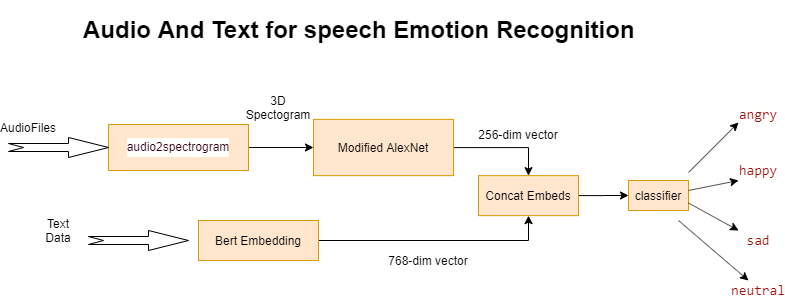

# MAS-Research
Multi-Modal Sentiment Analysis Research

For this project, we to aim implement a series of models that help us understand the initial aproaches to the Multi-Model sentiment analysis problem, finding the difficulties that it entails and studying the modern solutions that are currently proposed. Our final goal is to document all our findings throuoghout the process, providing our impressions. Note, that even though we will dive into the most controversial issues, we do not try to implement no state-of-the-art solution, but at most judge possible small improvements.

Finally, be aware this research is conditioned by time as well as computational resources, so its important to highlight that it does not intend to be a repository of potentially useful implemetations, but rather a guide for (our) academic enhacement.


## Project Structure

```
|-- MSA-Research
|   |-- data
|   |   |-- IEMOCAP
|   |   |   |-- ...
|   |   |-- SentiCap
|   |   |   |-- ... 
|   |-- docs
|   |   |-- MSA_Project_Proposal.pdf
|   |   |-- MSA_Project_Report.pdf
|   |-- images
|   |   |-- Audio-and-Text-Model_image.png
|   |-- models
|   |   |-- audio
|   |   |   |-- __init__.py
|   |   |   |-- attention.py
|   |   |   |-- cnn.py
|   |   |-- image
|   |   |   |-- __init__.py
|   |   |   |-- resnet.py
|   |   |-- text
|   |   |   |-- __init__.py
|   |   |   |-- bertEmbedding.py
|   |   |-- __init__.py
|   |   |-- AAT_model.py
|   |   |-- OTE_model.py
|   |-- src
|   |   |-- AAT
|   |   |   |-- __init__.py
|   |   |   |-- evaluate.py
|   |   |   |-- train.py
|   |   |   |-- train_functions.py
|   |   |-- OTE
|   |   |   |-- __init__.py
|   |   |   |-- evaluate.py
|   |   |   |-- train.py
|   |   |   |-- train_functions.py
|   |   |-- data
|   |   |   |-- IEMOCAP
|   |   |   |   |-- __init__.py
|   |   |   |   |-- data.py
|   |   |   |   |-- file_management.py
|   |   |   |-- SentiCap
|   |   |   |   |-- __init__.py
|   |   |   |   |-- data.py
|   |   |   |-- __init__.py
|   |   |-- __init__.py
|   |   |-- utils.py
|   |-- .gitignore
|   |-- README.md
```

## Models

### Audio-and-Text Model (AAT)

This model only uses audio and text input. It takes the data from the IEMOCAP dataset.

**Audio processing**

Audio input is passed as a 3D spectrogram representation, with shape `[batch size, f, t, c]` where f is the frequency dimension, t the time dimension and c the channel.

Then is processed by a FCN version of AlexNet into a tensor of shape `[batc, F, T, C]` and passed to an Attention layer to obtain a representation of the data as `[batch, C]`

This attention layer can be substitued by a FC layer.

**Text processing**

The text input is passed already tokenized and then embedded using a pretrained BERT model. After that, were a left with a tensor `[batch, sequence size, embedding dim]` which has its last two dimensions squeezed and passed through a FC layer a transformed into `[batch, text embedding size]`.

**Audio and Text processing**

For featur fusion we simply concatenate both outputs of the individual processing modules, obtaining a tensor shaped `[batch, C + text embedding dim]`. This is then  passed to a FC layer (with dropout) that act as the classifier.




### Output Transformer Encoder Model (OTE)

Output Transform Encoder Model for Multimodal Sentimen Analysis, described by Zheng Yixiao (https://github.com/YeexiaoZheng/Multimodal-Sentiment-Analysis?tab=readme-ov-file). This model uses image and text extracted from the SentiCap dataset.

**Image processing**

The image input is a tensor of shape `[batch, in channels, h, w]`. It passes through a ResNet-50 module and is converted into `[batch, image output dim]`

**Text processing**

As well as in the AAT model, the text input is passed already tokenized and then embedded using a pretrained BERT model. After that, were a left with a tensor `[batch, sequence size, embedding dim]` which has its last two dimensions squeezed and passed through a FC layer a transformed into `[batch, text output dim]`.

**Image and Text processing**

The concatenation of the output of both image and text individual processing modules is passed into an attention layer represented by a Transformer Encoder. After that, we are left with an output tensor of shape `[batch, image output dim + text output dim]` (equal to the input dimensions), which is passed through a final classifier module composed of a FC layer. Finally, the output will be a tensor of shape `[batch, num classes]` containing the logits for each class.

