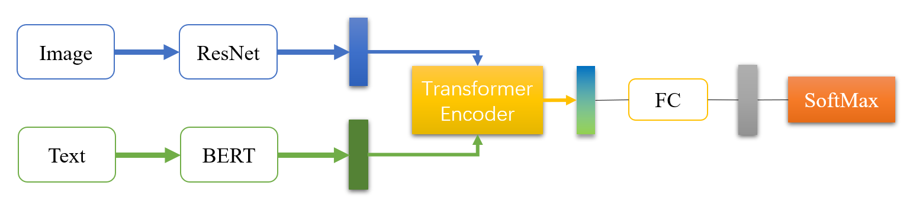

# MAS-Research
Multi-Modal Sentiment Analysis Research

For this project, we aim to implement a series of models that help us understand the initial aproaches to the Multi-Model sentiment analysis problem, finding the difficulties that it entails and studying the modern solutions that are currently proposed. Our final goal is to document all our findings throuoghout the process, providing our impressions. Note, that even though we will dive into the most controversial issues, we do not try to implement no state-of-the-art solution, but at most judge possible small improvements.

Finally, be aware this research is conditioned by time as well as computational resources, so its important to highlight that it does not intend to be a repository of potentially useful implemetations, but rather a guide for (our) academic enhacement.


## Project Structure

```
|-- MSA-Research
|   |-- credentials
|   |-- data
|   |   |-- Embeddings
|   |   |   |-- ...
|   |   |-- IEMOCAP
|   |   |   |-- ...
|   |   |-- SentiCap
|   |   |   |-- ... 
|   |-- docs
|   |   |-- MSA_Project_Proposal.pdf
|   |   |-- MSA_Project_Report.pdf
|   |-- images
|   |   |-- AAT_Model_image.png
|   |   |-- OTE_Model_image.png
|   |-- models
|   |   |-- audio
|   |   |   |-- __init__.py
|   |   |   |-- attention.py
|   |   |   |-- cnn.py
|   |   |-- image
|   |   |   |-- __init__.py
|   |   |   |-- resnet.py
|   |   |-- text
|   |   |   |-- __init__.py
|   |   |   |-- bertEmbedding.py
|   |   |   |-- word2vec.py
|   |   |-- __init__.py
|   |   |-- AAT_model.py
|   |   |-- OTE_model.py
|   |-- src
|   |   |-- AAT
|   |   |   |-- __init__.py
|   |   |   |-- evaluate.py
|   |   |   |-- train.py
|   |   |   |-- train_functions.py
|   |   |-- OTE
|   |   |   |-- __init__.py
|   |   |   |-- evaluate.py
|   |   |   |-- train.py
|   |   |   |-- train_functions.py
|   |   |-- data
|   |   |   |-- IEMOCAP
|   |   |   |   |-- __init__.py
|   |   |   |   |-- data.py
|   |   |   |   |-- file_management.py
|   |   |   |-- SentiCap
|   |   |   |   |-- __init__.py
|   |   |   |   |-- data.py
|   |   |   |   |-- file_management.py
|   |   |   |-- __init__.py
|   |   |-- __init__.py
|   |   |-- utils.py
|   |-- .gitignore
|   |-- README.md
|   |-- requirements.txt
```

## Models

### Audio-and-Text Model (AAT)

This model only uses audio and text input. It takes the data from the IEMOCAP dataset.

#### Audio processing

Audio input is passed as a 3D spectrogram representation, with shape `[batch size, f, t, c]` where f is the frequency dimension, t the time dimension and c the channel.

Then is processed by a FCN version of AlexNet into a tensor of shape `[batc, F, T, C]` and passed to an Attention layer to obtain a representation of the data as `[batch, C]`

This attention layer can be substitued by a FC layer.

#### Text processing

The text input is passed already tokenized and then embedded using a pretrained BERT model. After that, were a left with a tensor `[batch, sequence size, embedding dim]` which has its last two dimensions squeezed and passed through a FC layer a transformed into `[batch, text embedding size]`.

#### Audio and Text processing

For featur fusion we simply concatenate both outputs of the individual processing modules, obtaining a tensor shaped `[batch, C + text embedding dim]`. This is then  passed to a FC layer (with dropout) that act as the classifier.


### Output Transformer Encoder Model (OTE)

Output Transform Encoder Model for Multimodal Sentimen Analysis, described by Zheng Yixiao (https://github.com/YeexiaoZheng/Multimodal-Sentiment-Analysis?tab=readme-ov-file). This model uses image and text extracted from the SentiCap dataset.

#### Image processing

The image input is a tensor of shape `[batch, in channels, h, w]`. It passes through a ResNet-50 module and is converted into `[batch, image output dim]`. We also added the possibility for the model to replace the ResNet-50 by a simple CNN in case the data or the computational resources are scarce.

#### Text processing

As well as in the AAT model, the text input is passed already tokenized and then embedded using a pretrained BERT model. After that, were a left with a tensor `[batch, sequence size, embedding dim]` which has its last two dimensions squeezed and passed through a FC layer a transformed into `[batch, text output dim]`.

Also, we added the possibility to use a word2vec embedding loaded from memory that is lighter than the BERT embedding, in case of scarse resources.

#### Image and Text processing

The concatenation of the output of both image and text individual processing modules is passed into an attention layer represented by a Transformer Encoder. After that, we are left with an output tensor of shape `[batch, image output dim + text output dim]` (equal to the input dimensions), which is passed through a final classifier module composed of a FC layer. Finally, the output will be a tensor of shape `[batch, num classes]` containing the logits for each class.



## Datasets

### IEMOCAP

We use IEMOCAP as a source of audio and text data. As mentioned before, we processed incoming audio data by transforming it into 3D spectrogram form, and the passing it to the model. In the case of text, we consider the embedding of the raw text as part of the data processing, since we had no intention of further traininf any of the embeddings.

This way, we constructed the dataprocessing stage to load the data spread across the multiple olders that form IEMOCAP, and safed the already processed tensors in memory. This strategy is used for better speed when loading data at every step, as well as sparing more RAM memory. This approach was not the initial strategy, as we started by loading from IEMOCAP and transforming the data at every step. Either way, RAM spare memory has shown improvements but the computational speed stayed pretty much the same.

### SentiCap

SentiCap contains images and text. The text is saved in a .csv file with a refernce to its correspondant image. The images are saved in a separate folder. THe text is composed of small description (arround 15-20 words) of the corresponding images. The images are not equally shaped and have really different sizes. This can be one of the main difficulties, sine very big images slow down the computations. To address this issue, we resize the images to 64x64 (default) in the dataprocessing stag.

As one may assume, this dataset is far lighter than the IEMOCAP, and that is the main reason why it has been used.

Finally, the same strategy as with the IEMOCAP dataset has been used in orther to speed up training and avoid overloading the RAM. Thus, data is processed once and saved as tensors (.pt files) in memory, so later can be retrieved very easily and fast. Again, using this method does not appear to have significant effects.


## Requirements

chardet==4.0.0
numpy==1.22.2
Pillow==9.2.0
scikit_learn==1.1.1
torch==1.8.2
torchvision==0.9.2
tqdm==4.63.0
transformers==4.18.0

```shell
pip install -r requirements.txt
```

## Train

All the results from training will be stored in a folder named `trained_models`

#### Audio-and-Text Model

```shell
python -m src.AAT.train
```

#### Output Transform Encoder Model
```shell
python -m src.OTE.train
```